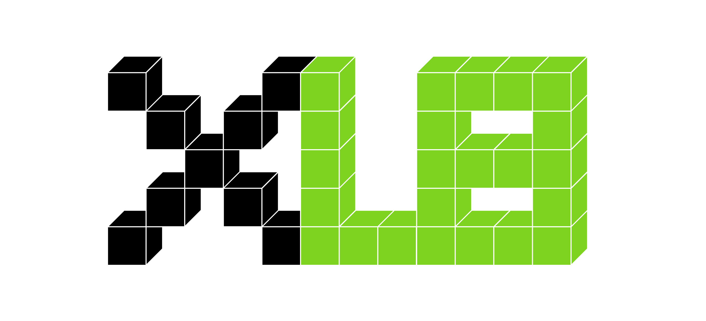
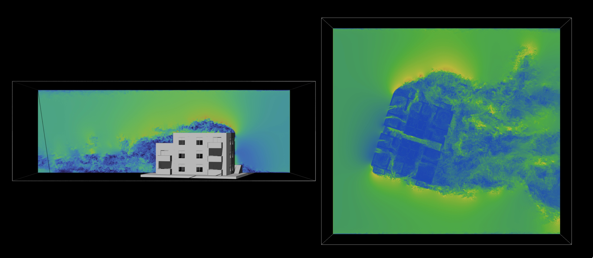
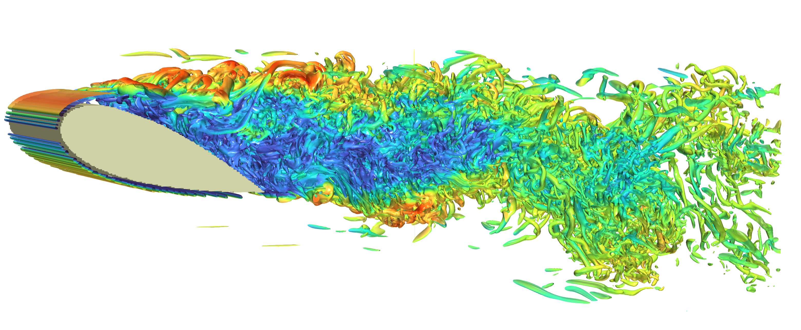

[](https://opensource.org/licenses/Apache-2.0)
[](https://star-history.com/#Autodesk/XLB)
<p align="center">
  
</p>

# XLB: A Hardware-Accelerated Differentiable Lattice Boltzmann Simulation Framework based on JAX for Physics-based Machine Learning

XLB (Accelerated LB) is a fully differentiable 2D/3D Lattice Boltzmann Method (LBM) solver that leverages hardware acceleration. It's built on top of the [JAX](https://github.com/google/jax) library and is specifically designed to solve fluid dynamics problems in a computationally efficient and differentiable manner. Its unique combination of features positions it as an exceptionally suitable tool for applications in physics-based machine learning.

## Key Features
- **Integration with JAX Ecosystem:** The solver can be easily integrated with JAX's robust ecosystem of machine learning libraries such as [Flax](https://github.com/google/flax), [Haiku](https://github.com/deepmind/dm-haiku), [Optax](https://github.com/deepmind/optax), and many more.
- **Scalability:** XLB is capable of scaling on distributed multi-GPU systems, enabling the execution of large-scale simulations on hundreds of GPUs with billions of voxels.
- **Support for Various LBM Boundary Conditions and Kernels:** XLB supports several LBM boundary conditions and collision kernels.
- **User-Friendly Interface:** Written entirely in Python, XLB emphasizes a highly accessible interface that allows users to extend the solver with ease and quickly set up and run new simulations.
- **Leverages JAX Array and Shardmap:** The solver incorporates the new JAX array unified array type and JAX shardmap, providing users with a numpy-like interface. This allows users to focus solely on the semantics, leaving performance optimizations to the compiler.
- **Platform Versatility:** The same XLB code can be executed on a variety of platforms including multi-core CPUs, single or multi-GPU systems, TPUs, and it also supports distributed runs on multi-GPU systems or TPU Pod slices.

## Documentation
The documentation can be found [here](https://autodesk.github.io/XLB/) (in preparation)
## Showcase

The following examples showcase the capabilities of XLB:

<p align="center">
  
</p>
<p align="center">
  Lid-driven Cavity flow at Re=100,000 (~25 million voxels)
</p>

<p align="center">
  
</p>
<p align="center">
  Airflow in to, out of, and within a building (~400 million voxels)
</p>


<p align="center">
  
</p>
<p align="center">
<a href=https://www.epc.ed.tum.de/en/aer/research-groups/automotive/drivaer > DrivAer model </a> in a wind-tunnel using KBC Lattice Boltzmann Simulation with approx. 317 million voxels
</p>

<p align="center">
  
</p>
<p align="center">
  Flow over a NACA airfoil using KBC Lattice Boltzmann Simulation with approx. 100 million voxels
</p>

## Capabilities 

### LBM
- BGK collision model (Standard LBM collision model)
- KBC collision model (unconditionally stable for flows with high Reynolds number)

### Lattice Models
- D2Q9
- D3Q19
- D3Q27 (Must be used for KBC simulation runs)

### Output
- Binary and ASCII VTK output (based on PyVista library)
- Image Output
- 3D mesh voxelizer using trimesh

### Boundary conditions
- **Equilibrium BC:** In this boundary condition, the fluid populations are assumed to be in at equilibrium. Can be used to set prescribed velocity or pressure.

- **Full-Way Bounceback BC:** In this boundary condition, the velocity of the fluid populations is reflected back to the fluid side of the boundary, resulting in zero fluid velocity at the boundary.

- **Half-Way Bounceback BC:** Similar to the Full-Way Bounceback BC, in this boundary condition, the velocity of the fluid populations is partially reflected back to the fluid side of the boundary, resulting in a non-zero fluid velocity at the boundary.

- **Do Nothing BC:** In this boundary condition, the fluid populations are allowed to pass through the boundary without any reflection or modification.

- **Zouhe BC:** This boundary condition is used to impose a prescribed velocity or pressure profile at the boundary.
- **Regularized BC:** This boundary condition is used to impose a prescribed velocity or pressure profile at the boundary. This BC is more stable than Zouhe BC, but computationally more expensive.
- **Extrapolation Outflow BC:** A type of outflow boundary condition that uses extrapolation to avoid strong wave reflections.

### Compute Capabilities
- Distributed Multi-GPU support
- JAX shard-map and JAX Array support
- Mixed-Precision support (store vs compute)
- [Orbax](https://github.com/google/orbax)-based distributed asynchronous checkpointing

## Installation Guide

To use XLB, you must first install JAX and other dependencies using the following commands:


Please refer to https://github.com/google/jax for the latest installation documentation. The following table is taken from [JAX's Github page](https://github.com/google/jax).

| Hardware   | Instructions                                                                                                    |
|------------|-----------------------------------------------------------------------------------------------------------------|
| CPU        | `pip install -U "jax[cpu]"`                                                                                       |
| NVIDIA GPU on x86_64 | `pip install -U "jax[cuda12_pip]" -f https://storage.googleapis.com/jax-releases/jax_cuda_releases.html`        |
| Google TPU | `pip install -U "jax[tpu]" -f https://storage.googleapis.com/jax-releases/libtpu_releases.html`                 |
| AMD GPU    | Use [Docker](https://hub.docker.com/r/rocm/jax) or [build from source](https://jax.readthedocs.io/en/latest/developer.html#additional-notes-for-building-a-rocm-jaxlib-for-amd-gpus). |
| Apple GPU  | Follow [Apple's instructions](https://developer.apple.com/metal/jax/).                                          |

**Note:** We encountered challenges when executing XLB on Apple GPUs due to the lack of support for certain operations in the Metal backend. We advise using the CPU backend on Mac OS. We will be testing XLB on Apple's GPUs in the future and will update this section accordingly.


Install dependencies:
```bash
pip install jmp pyvista numpy matplotlib Rtree trimesh jmp
```

Run an example:
```bash
git clone https://github.com/Autodesk/XLB
cd XLB
export PYTHONPATH=.
python3 examples/cavity2d.py
```
## Citing XLB
Accompanying paper will be available soon.